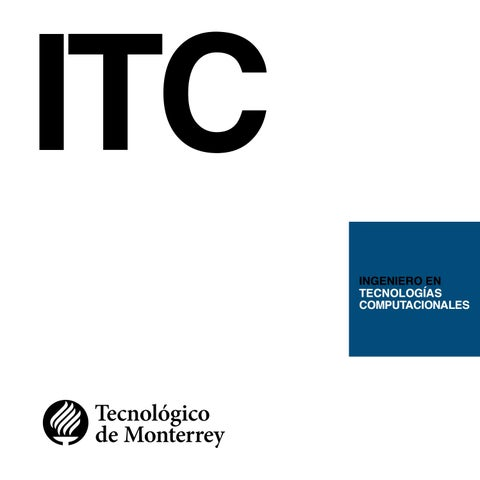

<!-- PROJECT LOGO -->
 

  

  <h3 align="center">Ingenieria en Tecnologías Computacionales</h3>

  

    Biblioteca ITC
    
  

    

<!-- TABLE OF CONTENTS -->

  
Tabla de contenido

  <ol>
    <li>
      <a href="#Acerca de la biblioteca">Acerca del proyecto</a>
    <li><a href="#Contribuye a nuestro código Biblioteca ITC">Contribuye</a></li>
  </ol>

<!-- ABOUT THE PROJECT -->
## Acerca de la biblioteca

### Propósito
Proporcionar a todos los alumnos de la carrera de ITC una herramienta de desarrollo técnico y personal, para que asi logren tener diferentes rutas de aprendizaje que pueden seguir para alcanzar sus objetivos y crecer profesionalmente. Proporcionar herramientas importantes tanto de los diferentes ámbitos profesionales, como cualquier herramienta de ámbito de desarrollo personal.

###  Alcance
En esta biblioteca se busca incluir a todos los alumnoss de la comunidad de Tecnológico de Monterrey, proporcionándoles herramientas de aprendizaje las cuales contienen diferentes temas, los cuales incluyen varios  recursos de aprendizaje de distintas plataformas. Estas rutas pueden ser creadas, borradas y cambiadas por los administradores de contenido.

(<a href="#top">back to top</a>)

## Aplicaciones 

En esta sección se proporcionan algunas de las aplicaciones para desarrollo web.    

* [PostgreSQL](https://www.postgresql.org/) 
* [Node.js](https://nodejs.org/es/) 
* [Next.js](https://nextjs.org/) 
* [AWS CLI](https://aws.amazon.com/cli/)

(<a href="#top">back to top</a>)

## Desarollo con Linux

En esta sección se proporcionan algunos de los recursos para desarollar en Linux.    

* [WSL2](https://learn.microsoft.com/en-us/windows/wsl/install)
* [Learn Linux](https://linuxjourney.com/)
* [Docker](https://www.docker.com/)
* [Docker Compose](https://docs.docker.com/compose/)

(<a href="#top">back to top</a>)

## Libros 

* [Cracking the Coding Interview](docs/Books/Interview%20Preparation/Cracking%20the%20Coding%20Interview%20-%20189%20Programming%20Questions%20and%20Solutions%20(6th%20Edition).pdf)
* [Code: The Hidden Language of Computers Hardware and Software](docs/Books/Theory/Code_%20The%20Hidden%20Language%20of%20Co%20-%20Charles%20Petzold.pdf)
* [The Essential Turing](docs/Books/Theory/The%20Essential%20Turing%20-%20B.%20Jack%20Copeland.pdf)
* [Automate the Boring Stuff](https://automatetheboringstuff.com/)
* [Fluent Python](docs/Books/Python/Fluent%20Python,%202nd%20Edition%20-%20Luciano%20Ramalho.epub)
* [Django for Beginners](docs/Books/Python/Django%20for%20Beginners%20-%20William%20S.%20Vincent.mobi)
* [Django for Professionals](docs/Books/Python/Django%20for%20Professionals%20-%20William%20S.%20Vincent.epub)
* [Django for APIs](docs/Books/Python/Django%20for%20APIs%20-%20William%20S.%20Vincent.epub)
* [Grokking Algorithms](docs/Books/Interview%20Preparation/Grokking%20Algorithms_%20An%20illustr%20-%20Aditya%20Y.%20Bhargava.epub)

(<a href="#top">back to top</a>)

## Canales de YouTube

* [FireShip](https://www.youtube.com/c/Fireship) - Desarrollo web y aplicaciones
* [Code Bullet](https://www.youtube.com/c/CodeBullet) - Inteligenica Artificial
* [NetworkChuck](https://www.youtube.com/c/NetworkChuck) - Redes, Cloud y Linux
* [Hussein Nasser](https://www.youtube.com/c/HusseinNasser-software-engineering) - Ingenieria de Software
* [Dennis Ivy](https://www.youtube.com/c/DennisIvy) - Desarrollo web con Django

(<a href="#top">back to top</a>)

<!-- CONTRIBUTING -->
## Contribuye a nuestro código Biblioteca ITC

Las contribuciones son lo que hace que la comunidad de código abierto sea un lugar increíble para aprender, inspirar y crear. Cualquier contribución que hagas es **muy apreciada**. 

Si tienes una sugerencia que mejoraría esto, bifurque el repositorio y cree una solicitud de extracción. También puede simplemente abrir un problema con la etiqueta "mejora".
¡No olvides darle una estrella al proyecto! ¡Gracias de nuevo!

1. Crea un Fork del proyecto (opcional)
2. Crea Branch
3. Genera un Commit de tus cambios
4. Push al Branch
5. Abre un Pull Request

(<a href="#top">back to top</a>)

